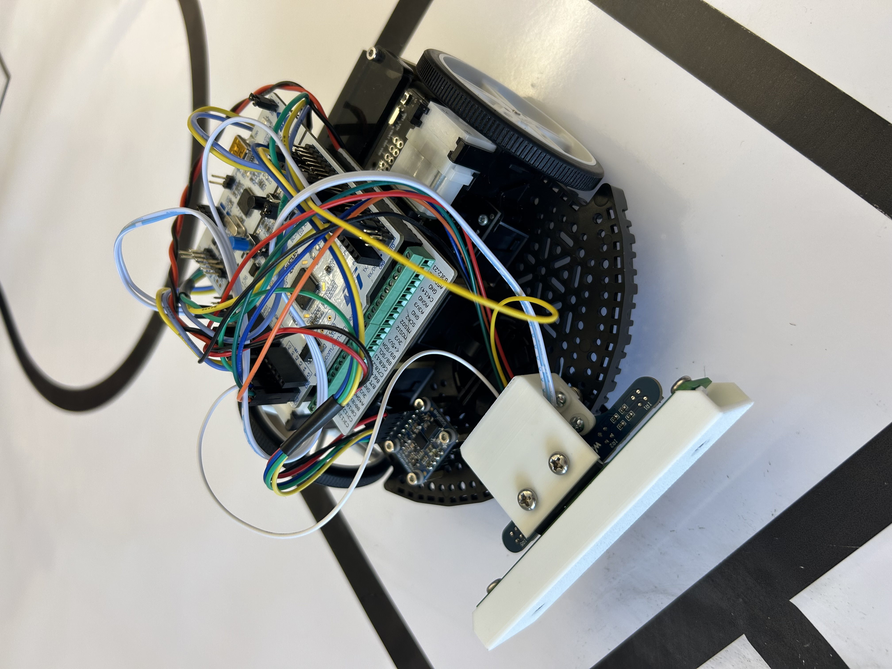

# ME_405_Linefollower

**Cal Poly Mechatronics Line Follower Robot**

This project involves a Romi robot configured and programmed using micropython to autonomously complete a line-following course and return to its initial start point. This involves line detection, bump detection, and relative position tracking. This work was completed by **Jack Ellis** and **Jacob Hambel**, with guidance and support from **Charlie Refvem**. 

---

## Main Features

- **Line Following Capability**: The robot uses infrared sensors to detect and follow a predefined line.
- **Obstacle Detection and Avoidance**: Equipped with bump sensors to handle unexpected obstacles.
- **Position Tracking**: Tracks its position relative to the starting point using encoders.

---

## Components Used

### Hardware:
- **Romi Chassis and Components**
- **BNO055 IMU sensor**: Detects acceleration, angular rate, and magnetic fields. Note - handle with care as it is sensitive to impact.
- **Infrared Line Sensors**: Five ITR20001/T infrared sensors for line detection.
- **Bump Sensor**: Detects obstacles to avoid collisions.

### Mechanical Design Files:
- `Line Sensor Mount` - [View Line Sensor Mount](./CAD/Lower_Bracket.py)  
- `Bump Sensor Mount` - [View Bump Sensor Mount](./CAD/Upper_Bracket.py)  
- `Bump Sensor Bumper` - [Bump Sensor Bumper](./CAD/Bump_Sensor.py)  
-    Bump sensor bumper is optional, the reason for its use in this project is to reduce the weight offset in the front.

---

## Wiring Information
- **Nucleo Pinout diagrams**
    See the Morpho Headers section on the [ST Nucleo-L475RG webpage](https://os.mbed.com/platforms/ST-Nucleo-L476RG/).
- **Pin assignment table**    

| Pin Name Nucleo | Pin Mode | Connection | Pin Name on device |
| --- | --- | --- | --- |
| PB_5 | Output, Push/Pull | Left Motor Enable |  |
| PB_3 | Output, Push/Pull | Left Motor Direction | DIR |
| PA_8 | Timer 1 CH 1 | Left Motor effort | PWM |
| PA_10 | Output, Push/Pull | Right Motor Enable |  | 
| PB_10 | Output, Push/Pull | Right Motor Direction | DIR |
| PB_6 | Timer 4 CH 1 | Right Motor effort | PWM |
| PA_6 | Timer 3 CH 1 | Right Encoder | ERB |
| PA_7 | Timer 3 CH 2 | Right Encoder | ERA |
| PA_0 | Timer 2 Ch 1 | Left Encoder | ELB |
| PA_1 | Timer 2 Ch 2 | Left Encoder | ELA |
| PC_1 | Analog input | Line sensor | IR1 |
| PB_1 | Analog input | Line sensor | IR2 |
| PC_3 | Analog input | Line sensor | IR3 |
| PC_0 | Analog input | Line sensor | IR4 |
| PB_0 | Analog input | Line sensor | IR5 |
| PC_4 | Analog input | Bump sensor | D |
| PA_4 | Output, Push/Pull | Reset Pin for IMU | RST |
| PB_8 | I2C1 SCL | I2C1 clock for I2C bus | SCL |
| PB_9 | I2C1 SDA | I2C1 serial data for I2C bus | SDA |

---

## Software

The control system implements a **PI control loop**, using encoder data and line sensor readings as feedback to maintain line tracking and accurate position. This program uses cooperative multitasking in a finite state machine to ensure all tasks run on time. To accomplish this, the scheduler is used with priority and duration

### Python Files:
- **`main.py`**: Main program orchestrating the robot’s behavior.  
[View main File](./code/main.py)  
- **`motor.py`**: Controls motor operations.  
[View Motor File](./code/motor.py)  
- **`encoder.py`**: Handles data from the encoders.  
[View IMU File](./code/encoder.py)  
- **`BNO055.py`**: Interface for the BNO055 sensor (if used).  
[View Line Sensor File](./code/BNO055.py)  
- **`irsensor.py`**: Reads data from the infrared sensors.  
[View Bump Sensor File](./code/irsensor.py)  
- **`bumpsensor.py`**: Reads data from the bump sensor.  
[View cotask File](./code/bumpsensor.py)  
- **`cotask.py`**: Manages cooperative multitasking.  
[View task_share File](./code/cotask.py)  
- **`task_share.py`**: Facilitates shared data between tasks.  
[View Main File](./code/task_share.py)  

### Code Functionality:
Main holds the task structure and is the file that runs when the robot is in motion. This file has X tasks, one for each of the states in the finite state machine. Within these tasks, classes are referenced to handle particular functions of the sensors, motor controller, and the IMU that the code interacts with. This keeps the length reasonable and improves the readibility of the code. Overall, the flow of the code wants to stay in line following mode. If the bump sensor is triggered, the obstacle avoidance measures will be taken until it finds a line again. After the bump sensor is triggered, the line sensor mode will look for all 5 sensors to detect a line. When this happens, that means Romi has found the end box. Romi will then proceed to the center of the box and rotate back to its original heading. After a brief pause, the Romi will begin driving straight on the original heading until all 5 line sensors detect a line, indicating that the start box has been reached. Then, it will stop in the start box completing the run of the course.

#### Motor
The motor class is responsible for updating the effort, direction, and enabling the motors. This class is called in 2 tasks by main to control each motor. The effort of the motor is output from a PWM at a duty cycle specified by the controller to attempt to create zero steady state error between the encoder readings and the omega reference. 

#### Encoder
The encoder class has several methods, each of which serve as getting data from the encoder. One method, **`update`** updates the encoder position with the current position. The method **`get_delta`** reads the difference between the current and last encoder reading. **`get_position`** returns the current position. These functions, combined with the use of **'utime.ticks()`** allows for calculation of the actual wheel speed. 

#### Line Sensor
The irsensor class is responsible for gathering the analog readings of the 5 infrared sensors, screening them against a threshold value for black or white, and returning them as a true or false. This class compiles the readings of the sensors into a 5 value list. This is convenient because based on which sensor reads the black value of 1, that is where the line is. To use this as feedback, each position is assigned a value, -4,2,0,2,4 reading left to right. Performing a dot product on these lists determines a value, either positive or negative, that becomes a modifier on the wheel speed set points. The class then returns this modifier for use in the control loop.

#### IMU
The BNO055 class is responsible for gathering readings from the IMU. There are many features of this class that are unused. Mainly, data regarding the heading and yaw rate are used in conjunction with wheel speed data from the encoders to track the position relative to start. The data is sent over the I2C bus for the microcontroller and updated each time the class is called.

#### Bump Sensor
The bumpsensor class is used when the robot encounters the wall. The wall is an 8 inch by 8 inch square. The bump sensor class indicates what steps need to be taken to get around this obstacle. The first method **`XXXXXXXXXX`** reads the bump sensor. This is how the program will know the bump sensor has encountered an obstacle. Once this happens, the method **`XXXXXXX`** will control the Romi's movement around the wall. First, a short reverse to give Romi some space from the obstruction. Next, a 90 degree turn. Now that the Romi is parallel to the wall, a rectangular path around it is traced, each section of movement has its own state. Finally, as Romi makes its last turn, the line sensor function takes over and finds the line.

#### Cotask
This file is provided for this project. Authored by Dr. Ridgely, **`cotask`** contains classes that can run cooperatively scheduled tasks in the context of a multitasking system. It uses the input scheduling algorithm to run tasks on time and in the proper order using closs called **`CoTaskList`**. 

#### Task_share
This file is provided for this project. Authored by Dr. Ridgely, **`task_share`** contains a class to allow tasks to share data without the risk of interrupts corrupting that data. This is very useful as variables may be shared between tasks without the need for global variables.

---

## Photos
Romi Front View:  
  
Romi Top View:  
  
Romi Side View:  
  
Romi Isometric View:  
  
Sensor Mounting:  
  
Line Sensor Orientation:  
  
Line follower in action:  
  

---

## Detailed Report

For an in-depth explanation of the project’s design, implementation, and results, please refer to the full report:
[ME_405_Ellis_Hambel_Line_Follower.pdf](./docs/ME_405_Ellis_Hambel_Line_Follower.pdf)

---